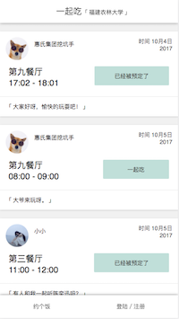
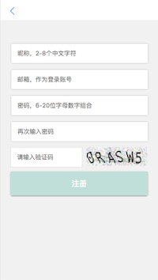
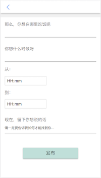

# eatTogether

> A Vue.js project

### 每天都是自己一个人吗？
### 一个人吃饭，一个人睡觉，一个人发呆，一个人看剧。
### 不得不说，这样真是.....  
### 爽翻了有没有！！！

好吧，虽然解决不了睡觉问题，但是让我们试着解决下吃饭问题，每天在食堂里飘，独身一人的真是好多呀。所以，开发了一个约饭（我想其实没什么用，而且只能在我们学校）。

体验地址：[eatTogether](http://eat.ryansky.cn/ "Title")

手机可以扫描二维码：

桌面浏览器请使用开发者模式，只适配了手机端。而且由于用的是腾讯云的学生机，所以性能不太好。

开发这个应用主要是vue练手，使用了vue全家桶，后台用的nodejs和mongodb

一共有7个页面，6个组件，不是很复杂，适合跟我一样的新手练手用。

部分页面 :

   

注册，登陆，修改头像，发布，删除发布，预定，取消预定。。

